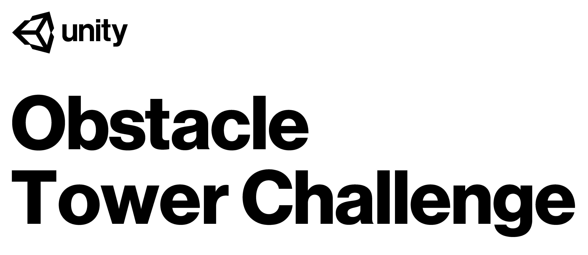

# Obstacle Tower Challenge Starter Kit

This repository provides instructions for how to submit to the [Obstacle Tower Challenge](https://unity3d.com/otc).

Your goal in the Obstacle Tower is to have your agent traverse the floors of a procedurally generated tower and 
climb to the highest level possible.  Each level is progressively more difficult, and you'll be tested against a 
towers generated with random seeds your agent hasn't seen before and thus will need to generalize from the 100 
provided tower seeds.

## Local Setup for Training

Before submitting to the challenge, you will want to train an agent to advance through the Obstacle Tower.

The first step is to clone this repository:

```
git clone git@github.com:Unity-Technologies/obstacle-tower-challenge.git
```

Next, install the following dependencies:

* **Python dependencies**
```
pip install -r requirements.txt
```
* **Obstacle Tower (Your OS)** Download the link for your OS [here](https://github.com/Unity-Technologies/obstacle-tower-env#download-the-environment) 
  and unzip in the `obstacle-tower-challenge` folder from the cloned repository.

Finally, you can run the environment using the included agent (in `run.py`) with random actions:

```
python run.py
```

**Note:** Your Obstacle Tower build must be located at `./ObstacleTower/obstacletower.XYZ` from the base of the 
cloned repository, where `XYZ` represents the appropriate file extension for your operating system's Obstacle Tower 
build.

### Next steps

Once you've set up your environment, you'll need to train your agent.  We've provided a [guide for using Google's Dopamine
library](https://github.com/Unity-Technologies/obstacle-tower-env/blob/master/examples/gcp_training.md) to train an agent on Google Cloud Platform.


## Testing Challenge Evaluation

Before making your challenge submission, you may want to test your agent using a similar environment to the one used for the official challenge evaluation. Your agent and the Obstacle Tower environment will be run in separate Docker containers which can communicate over the local network.

### Dependencies

* **Docker** See instructions [here](https://docs.docker.com/install/)
* **aicrowd-repo2docker** 
```
pip install aicrowd-repo2docker
# or
pip install -r requirements.txt
```
* **Obstacle Tower (Linux)** Download the linux build for docker evaluation [here](https://github.com/Unity-Technologies/obstacle-tower-env#download-the-environment) 
  and unzip in the `obstacle-tower-challenge` folder from the cloned repository.

### Build the Docker image

We've provided a build script that uses `aicrowd-repo2docker` to build an image `obstacle_tower_challenge:latest` from your repository.  Ensure [Docker](https://docs.docker.com/install/) is running on your machine, then run:
```
./build.sh
```

### Run Docker image

Now that you've built a Docker image with your agent script and the Obstacle Tower environment binary, you can run both the agent and 
the environment within a separate container:
```
# Start the container running your agent script.
docker run \
  --env OTC_EVALUATION_ENABLED=true \
  --network=host \
  -it obstacle_tower_challenge:latest ./run.sh

# In another terminal window, execute the environment.
docker run \
  --env OTC_EVALUATION_ENABLED=true \
  --env OTC_DEMO_EVALUATION=true \
  --network=host \
  -it obstacle_tower_challenge:latest ./env.sh
```

The environment script should output the evaluation state as it advances, recording overall state as well as the progress within each episode for seeds 101-105:
```json
{"state":"PENDING","floor_number_avg":0.0,"reward_avg":-1.0,"episodes":[],"last_update":"2019-02-09T00:17:15Z"}
{"state":"IN_PROGRESS","floor_number_avg":0.0,"reward_avg":-1.0,"episodes":[{"state":"IN_PROGRESS","seed":101,"floor_number":0,"reward":0.0,"step_count":0}],"last_update":"2019-02-09T00:17:16Z"}
...
```

## Submission

To submit to the challenge you'll need to ensure you've set up an appropriate repository structure, create a private git repository at https://gitlab.aicrowd.com with the contents of your submission, and push a _git tag_ corresponding to the version of your repository you'd like to submit.

### Repository Structure

#### aicrowd.json

Each repository should have a `aicrowd.json` file with the following fields:

```json
{
    "challenge_id" : "unity-obstacle-tower-challenge-2019",
    "grader_id": "unity-obstacle-tower-challenge-2019",
    "authors" : ["aicrowd-user"],
    "description" : "Random Obstacle Tower agent",
    "gpu": false,
    "debug": false
}
```

This file is used to identify your submission as a part of the Obstacle Tower Challenge.  You must use the `challenge_id` and `grader_id` specified above in the submission.  The `gpu` field specifies whether or not your model will require a GPU for evaluation. You can set the `debug` field to `true` if you want to view logs of your submission for debugging purposes ([more information here](https://discourse.aicrowd.com/t/announcement-debug-your-submissions/591)).

#### Submission environment configuration

You can specify your software environment by using all the [available configuration options of repo2docker](https://repo2docker.readthedocs.io/en/latest/config_files.html).

For example, to use Anaconda configuration files you can include an **environment.yml** file:
```
conda env export --no-build > environment.yml
```

It is important to include `--no-build` flag, which is important for allowing your Anaconda config to be replicable cross-platform.

#### Code Entrypoint

The evaluator will use `/home/aicrowd/run.sh` as the entrypoint. Please remember to have a `run.sh` at the root which can instantiate any necessary environment variables and execute your code. This repository includes a sample `run.sh` file.

### Submitting 
To make a submission, you will have to create a private repository on [https://gitlab.aicrowd.com](https://gitlab.aicrowd.com).

You will have to add your SSH Keys to your GitLab account by following the instructions [here](https://docs.gitlab.com/ee/gitlab-basics/create-your-ssh-keys.html).
If you do not have SSH Keys, you will first need to [generate one](https://docs.gitlab.com/ee/ssh/README.html#generating-a-new-ssh-key-pair).

Then you can create a submission by making a *tag push* to your repository, adding the correct git remote and pushing to the remote:

```
cd obstacle-tower-challenge
# Add AICrowd git remote endpoint
git remote add aicrowd git@gitlab.aicrowd.com:<YOUR_AICROWD_USER_NAME>/obstacle-tower-challenge.git
git push aicrowd master

# Create a tag for your submission and push
git tag -am "v0.1" v0.1
git push aicrowd master
git push aicrowd v0.1

# Note : If the contents of your repository (latest commit hash) does not change, 
# then pushing a new tag will not trigger a new evaluation.
```
You now should be able to see the details of your submission at : 
[gitlab.aicrowd.com/<YOUR_AICROWD_USER_NAME>/obstacle-tower-challenge/issues](gitlab.aicrowd.com/<YOUR_AICROWD_USER_NAME>/obstacle-tower-challenge/issues)
